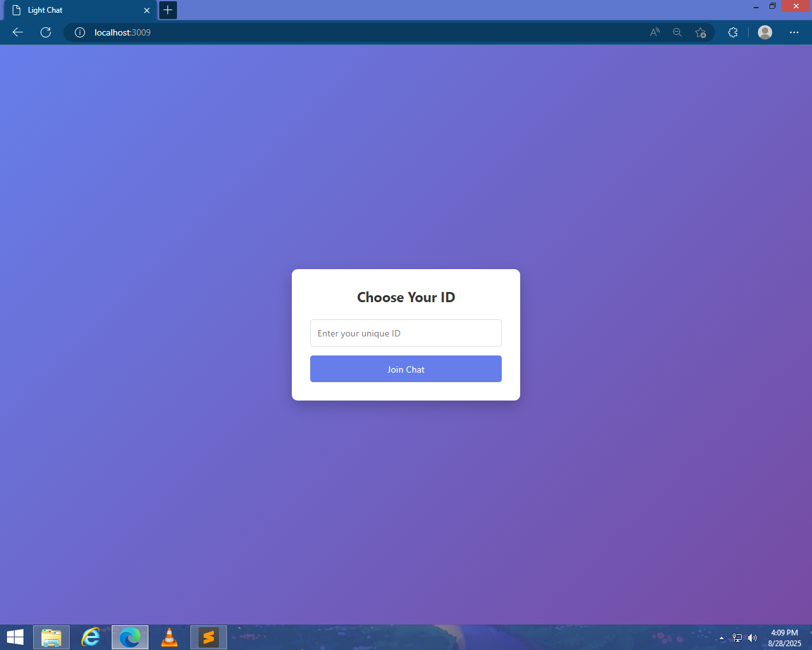
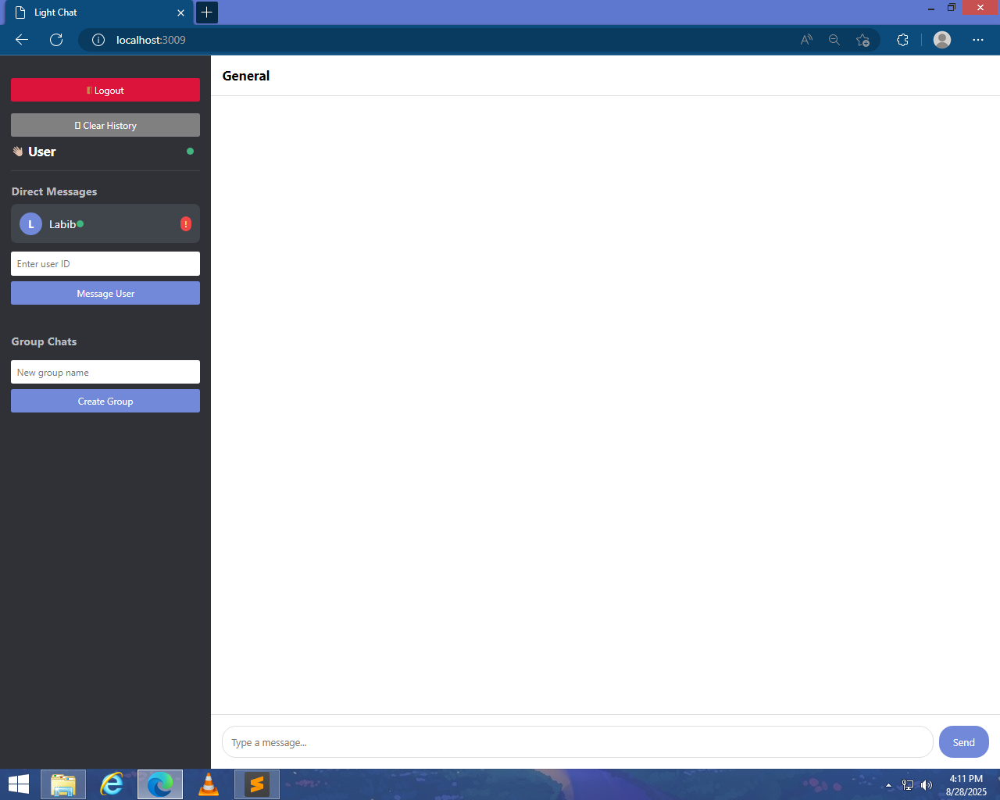
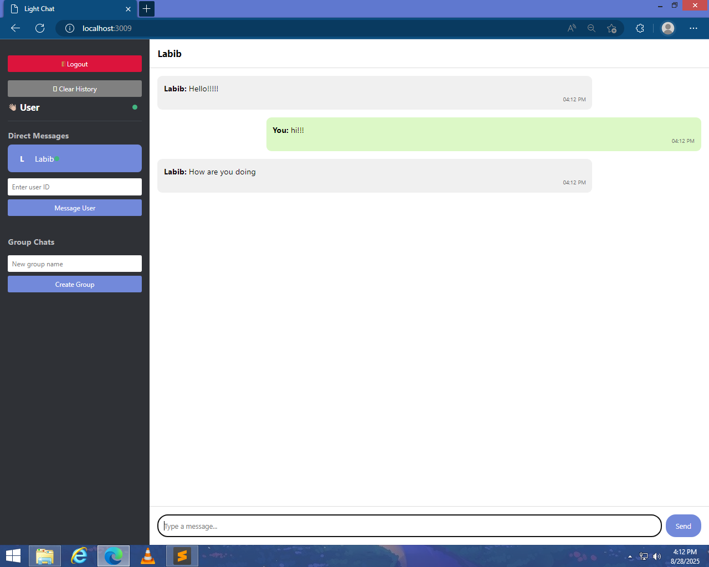

"
# 💬 LightChat  

**LightChat** is a real-time **chat application** built with Flask and Socket.IO, supporting **private messaging, group chats, and online user tracking**.  

Designed for:  
- 💻 Users who want a **lightweight local chat app**  
- ⚡ Quick communication on your network or server  
- 🛠️ Low-end PCs or local networks  

## 🚀 Features  
- 🔑 User registration and online status tracking  
- 📨 Private messaging between users  
- 👥 Group chats with multiple users  
- Real-time updates using **Socket.IO**  
- Easy to deploy locally or on a server  

## 🛠️ Tech Stack  
- **Backend:** Python (Flask + Flask-SocketIO)  
- **Frontend:** HTML, CSS, JavaScript  
- **Other:** Jinja2 templates, Socket.IO for real-time communication  

## 📂 Project Structure  
```
LightChat/
│── app.py                # Flask + SocketIO app
│── templates/            # HTML templates
│── static/               # CSS, JS, icons
│── screenshots/          # Screenshots
│   ├── screenshot1.png
│   ├── screenshot2.png
│   └── screenshot3.png
│── README.md
```

## ⚙️ Installation  

1. Clone this repository:  
```bash
git clone https://github.com/yourusername/LightChat.git
cd LightChat
```

2. Install dependencies:  
```bash
pip install flask flask-socketio
```

3. Run the app:  
```bash
python app.py
```

4. Open in your browser:  
```
http://127.0.0.1:3009
```

5. To access from other devices on your network, use your **PC’s IP address**:  
```
http://YOUR_PC_IP:3009
```

---

## 🎮 Usage  

1. Open the app in your browser  
2. Register a unique user ID  
3. Send **private messages** to other users  
4. Join a **group chat** to communicate with multiple users  
5. See who is online in real-time  

---

## 📷 Screenshots  

### Screenshot 1


### Screenshot 2


### Screenshot 3


---

## 🤝 Contributing  
Pull requests are welcome! For major changes, please open an issue first to discuss what you’d like to change.  
